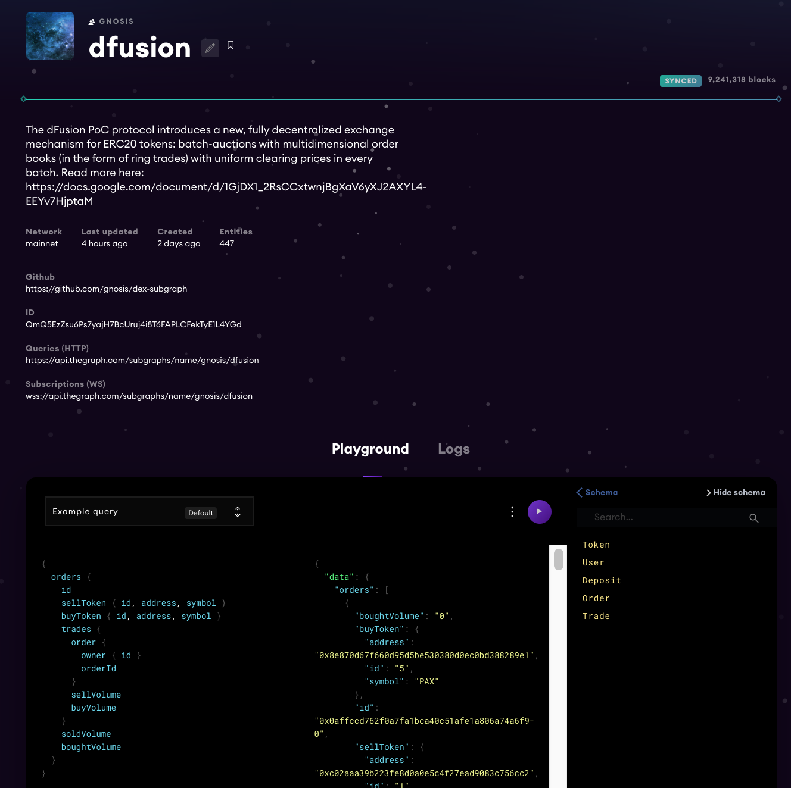

# dFusion subgraph


Implements a subgraph for the [dFusion protocol](https://github.com/gnosis/dex-contracts)

* [Subgraph in Mainnet](https://thegraph.com/explorer/subgraph/gnosis/dfusion)
* [Subgraph in Rinkeby](https://thegraph.com/explorer/subgraph/gnosis/dfusion-rinkeby)


For more information see https://thegraph.com/docs/.

---

## Setup environment

```bash
# Install dependencies
yarn

# Create your own environment file
cp .env.example .env
```

Edit `.env` and setup your own config

## Setup for local development
> First setup environment (see above)

1. Run a local ganache-cli and migrate the dependencies
   > TODO: Initially this step was done in the same project, but there's a dependency issue to solve in dex-contracts. It's better for now cloning dex-contracts and migrating separatelly

```bash
# Run a local ganache in one tab
npx ganache-cli -h 0.0.0.0 --gasLimit 8e6

# Clone dex-contracts project (in another tab)
#   It doesn't matter where you clone the project, this project is independent from dex-subgraph
git clone https://github.com/gnosis/dex-contracts 

# Install dependencies 
cd dex-contracts
yarn

# Migrate dependencies (in another tab)
npx truffle networks --clean || true
npx truffle migrate

# Setup 3 testing account and tokens
npx truffle exec scripts/stablex/setup_environment.js

# Check the deployed addresses
#   write down "BatchExchange" address for the testnet, we'll need it later
npx truffle networks
```

2. In dex-subgraph. Create a new file `config/ganache.json` using [ganache.example.json](.config/ganache.example.json) as an example. Fill the address for the contracts deployed in ganache:

```bash
# Create ganche conf
cp config/ganache.example.json config/ganache.json

# Add the address of "BatchExchange" contract you wrote down in the step (1)
vim config/ganache.json
```

3. Run a local The Graph Node

```bash
# Clone The Graph node
git clone https://github.com/graphprotocol/graph-node/
cd graph-node/docker

# Run it
docker-compose up
```

4. In dex-subgraph. Create a local subgraph:

```bash
# Create a new subgraph
yarn create-ganache

# Deploy it
yarn deploy
```

The subgraph should be accesible in: http://127.0.0.1:8000/subgraphs/name/gnosis/dfusion/graphql

## Local development: Deposit, claim, place orders

> First setup for local development (see above)

In dex-contracts project:

```bash
# place order
npx truffle exec scripts/stablex/place_order.js --accountId=0 --buyToken=1 --sellToken=0 --minBuy=999 --maxSell=2000 --validFor=20

# Deposit
npx truffle exec scripts/stablex/deposit.js --accountId=0 --tokenId=0 --amount=3000

# Wait 300s
npx truffle exec scripts/wait_seconds.js 300

# Claim
npx truffle exec scripts/stablex/claim_withdraw.js --tokenId 0xc778417e063141139fce010982780140aa0cd5ab
```

## Update to a new version of the contracts

> First setup for local development (see above)

1. Make sure you use the latest version of `dex-contracts`
```bash
# See all available versions in: https://www.npmjs.com/package/@gnosis.pm/dex-contracts
npm ls @gnosis.pm/dex-contracts
```

2. Update the ABI

```bash
# Install new version of dex-contracts
yarn add @gnosis.pm/dex-contracts@<new-version> --save

# Update ABI
yarn abi
```

3. Make sure the addresses are updated
```bash
# Show the addresses for all the networks
yarn addresses

# Update the addresses and the start block
vim config/rinkeby.json
vim config/rinkeby.json
```


4. Review the differences between the two version in the contract, and adapt all the handlers.


5. Regenerate the model:

```bash
yarn gen
```

## Deploy to rinkeby or mainnet

> First update the version of dex-contracts if it's not up to date

Deploy to the different networks:
```bash
# Make sure you are authenticated
graph auth https://api.thegraph.com/deploy/ <your-access-token>

# Deploy to rinkeby
yarn deploy-rinkeby

# Deploy to mainnet
yarn deploy-mainnet
```

## Troubleshooting
```bash
# Delete all containers and data
docker-compose down && rm -rf data

# Run the graph
docker-compose up
```
